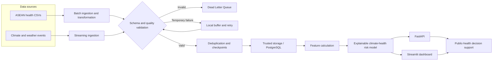
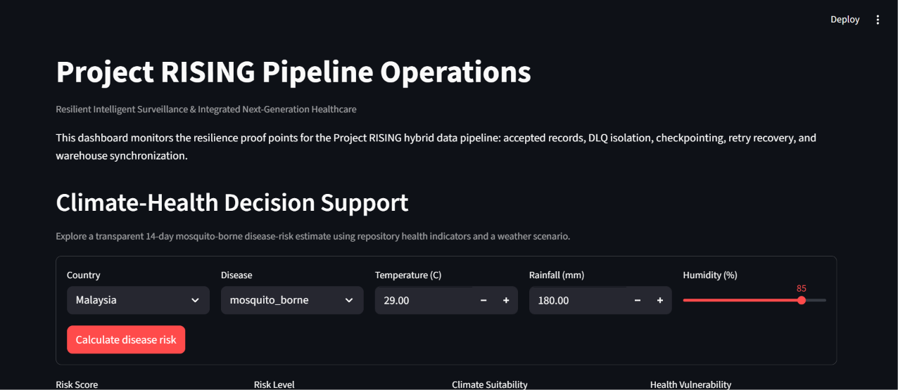
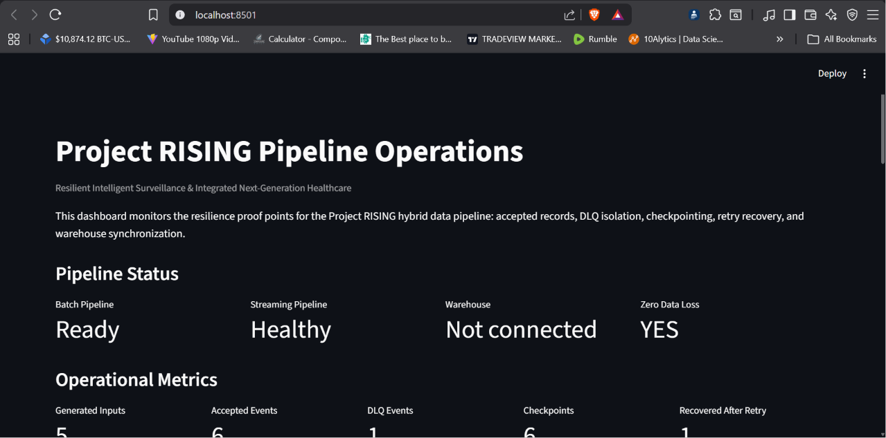

# Project RISING

**Resilient public-health intelligence when climate disruption breaks normal infrastructure.**

[](https://github.com/DevDataMLOps/Project-Rising/actions/workflows/tests.yml)


[Live Dashboard](https://project-rising.streamlit.app/) · [Live API](https://project-rising-api.onrender.com/) · [Interactive API Docs](https://project-rising-api.onrender.com/docs) · [Hackathon Submission](https://www.10alytics.io/hackathon/projects/23) · [Source Code](https://github.com/DevDataMLOps/Project-Rising)

RISING means **Resilient Intelligent Surveillance & Integrated Next-Generation Healthcare**. It combines governed ASEAN health data, resilient climate-event processing, an explainable disease-risk model, FastAPI endpoints, and an interactive Streamlit decision-support dashboard.

## Judge Quick Start

From a fresh clone with Python 3.11+:

```bash
python -m venv .venv
# Windows: .venv\Scripts\activate
# macOS/Linux: source .venv/bin/activate
python -m pip install --upgrade pip
python -m pip install -r requirements.txt
python -m pytest -q
```

Start the API:

```bash
python -m uvicorn main:app --reload
```

Open <http://127.0.0.1:8000/docs>, or get a real sample prediction:

```bash
curl http://127.0.0.1:8000/api/v1/disease-risk/sample
```

Start the dashboard in a second terminal:

```bash
python -m streamlit run demo/pipeline_operations_dashboard.py
```

The dashboard opens at <http://localhost:8501>. It automatically creates the small streaming-demo outputs when they do not exist.

## The Problem

Typhoons, floods, heatwaves, and rural infrastructure outages can delay public-health data. Records may arrive late, duplicate, become malformed, or disappear before decision-makers can act. Project RISING treats disruption as an expected operating condition and preserves records through validation, buffering, retry, idempotency, and dead-letter isolation.

## End-to-End Solution



The result is both operational resilience and a visible decision-support output: a country-specific, 14-day mosquito-borne disease-risk estimate with the climate and health factors that produced it.

## Disease-Risk Prediction

`POST /api/v1/disease-risk/predict` combines requested weather conditions with the latest available country values for malaria prevalence and infant mortality. The transparent model weights climate suitability at 70% and historical health vulnerability at 30%. It is deterministic, explainable, and intentionally labeled as a hackathon decision-support model—not a clinical or epidemiological forecast.

Example request:

```bash
curl -X POST http://127.0.0.1:8000/api/v1/disease-risk/predict \
  -H "Content-Type: application/json" \
  -d '{"country":"Philippines","disease":"dengue","temperature_c":29,"rainfall_mm":180,"humidity_pct":85}'
```

Example output (generated by the repository, abbreviated):

```json
{
  "country": "Philippines",
  "disease": "Dengue",
  "forecast_window": "next 14 days",
  "risk_score": 66.9,
  "risk_probability": 0.669,
  "risk_level": "high",
  "model": {
    "name": "RISING Explainable Climate-Health Risk Model",
    "version": "1.0.0",
    "type": "deterministic statistical scoring model"
  },
  "recommendations": [
    "Escalate vector-control and case-surveillance activities.",
    "Pre-position diagnostics, treatment supplies, and response staff."
  ]
}
```

Run the endpoint to obtain the current exact output. The checked-in test suite verifies that the wet-weather scenario has higher risk than a dry scenario.

## Dashboard

The Streamlit app provides two judge-ready views in one lightweight UI:

- **Climate-health decision support:** choose country, disease, temperature, rainfall, and humidity; inspect the score, level, evidence, recommendations, and API-ready JSON.
- **Pipeline operations:** inspect accepted events, DLQ records, checkpoints, retry recovery, record routing, and optional warehouse status.

| Climate-health decision support | Pipeline operations dashboard |
|---|---|
|  |  |

The deployed FastAPI includes interactive Swagger documentation at the
[live `/docs` endpoint](https://project-rising-api.onrender.com/docs).

## Full Demo Commands

Run the batch ETL:

```bash
python -m pipelines.run_etl
```

Run the resilient streaming scenario:

```bash
python demo/run_streaming_demo.py
```

Optionally load accepted events into PostgreSQL:

```bash
docker compose up -d postgres
python demo/run_streaming_demo.py --load-postgres
```

Inspect warehouse rows:

```bash
docker compose exec postgres psql -U rising_user -d project_rising -c "SELECT event_id, observed_at, temperature_c, humidity_pct, rainfall_mm FROM fact_weather_observation ORDER BY observed_at DESC LIMIT 10;"
```

## API Reference

| Method | Endpoint | Purpose |
|---|---|---|
| `GET` | `/health` | Service health check |
| `GET` | `/api/v1/health-indicators` | Filter processed health indicators |
| `GET` | `/api/v1/climate-events` | Read accepted climate events when configured |
| `GET` | `/api/v1/pipeline/status` | Inspect pipeline readiness |
| `GET` | `/api/v1/countries/{country}/risk` | Legacy comparative country score |
| `POST` | `/api/v1/disease-risk/predict` | Explainable climate-health prediction |
| `GET` | `/api/v1/disease-risk/sample` | Ready-to-show prediction sample |

Example health query:

```bash
curl "http://127.0.0.1:8000/api/v1/health-indicators?country=Philippines&indicator=malaria_prevalence&limit=5"
```

## Technology Stack

| Layer | Technology |
|---|---|
| API and validation | FastAPI, Pydantic, Uvicorn |
| Data processing | Python, pandas, NumPy, Pandera |
| Decision support | Explainable deterministic statistical model |
| Dashboard | Streamlit, Plotly |
| Streaming resilience | JSONL event stream, retry queue, DLQ, checkpoints |
| Warehouse | PostgreSQL, SQLAlchemy, Docker Compose |
| Quality | pytest, GitHub Actions |

## Project Structure

```text
Project-Rising/
├── api/                 FastAPI routes and services
│   ├── routes/          Health, climate, pipeline, and risk endpoints
│   └── services/        Data access and disease-risk model
├── data/                Raw and processed ASEAN datasets
├── demo/                Stream resilience demo and Streamlit dashboard
├── docs/                Architecture, governance, methodology, demo assets
├── pipelines/           Batch extract, transform, validate, and load stages
├── schemas/             Health and weather data contracts
├── sql/                 Warehouse dimensions, facts, and metadata DDL
├── streaming/           Producer, consumer, retry, DLQ, and deduplication
├── tests/               API, model, pipeline, and resilience tests
├── warehouse/           PostgreSQL connectivity and weather loader
├── main.py              FastAPI application entry point
└── docker-compose.yml   Local PostgreSQL service
```

## Minimum Viable Product (MVP): Capability Features

| Requirement | Implementation evidence | Status |
|---|---|---|
| ADHCRI / climate-resilient healthcare | Resilient hybrid pipeline, retries, DLQ, checkpoints | Implemented |
| Health and climate data integration | Processed ASEAN indicators plus climate-event scenarios | Implemented |
| AI / intelligent decision support | Explainable disease-risk endpoint and interactive controls | Implemented |
| Working backend | FastAPI app and Swagger/OpenAPI docs | Implemented |
| Data engineering / ETL | Batch pipeline, schema validation, metadata, warehouse loading | Implemented |
| Interactive presentation | Streamlit decision-support and operations dashboard | Implemented |
| End-to-end story | Source-to-decision diagram, API, dashboard, demo script | Implemented |
| Reliability and cybersecurity | Validation, isolation, idempotency, security architecture | Implemented/design documented |
| Testing and reproducibility | pytest suite and GitHub Actions | Implemented |
| UN SDG alignment | SDG 3, 9, 13, and 17 | Aligned |
| Public deployment | [API](https://project-rising-api.onrender.com/) and [Streamlit dashboard](https://project-rising.streamlit.app/) | Implemented |

## Documentation

- [System architecture](docs/architecture/01_system_architecture.md)
- [End-to-end data flow](docs/architecture/02_data_flow.md)
- [AI and decision-support architecture](docs/architecture/03_ai_architecture.md)
- [Security architecture](docs/architecture/04_security_architecture.md)
- [Climate-resilience architecture](docs/architecture/05_climate_resilience.md)
- [Original resilience demo guide](docs/demo_script.md)

## Responsible Use and MVP Boundaries

- The model uses aggregated public-health data and user-supplied weather conditions.
- It provides an explainable preparedness signal, not patient-level advice.
- It has not been trained or clinically validated against outbreak labels.
- Simulated climate events prove resilience behavior; a live weather provider remains a production integration.
- Human public-health teams remain responsible for decisions and local verification.

## License

Released under the [MIT License](LICENSE).
