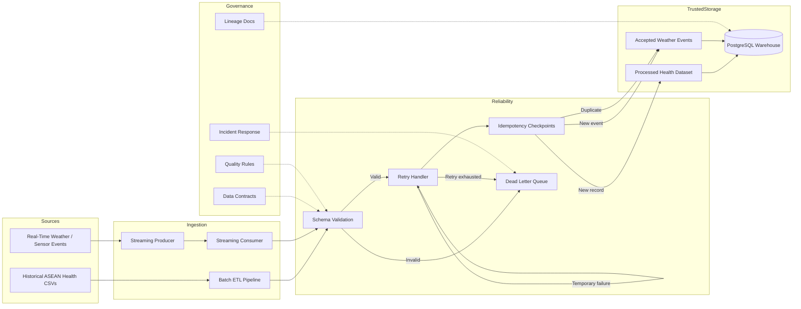

# Project RISING System Architecture

## Objective

Project RISING is a climate-resilient health data engineering platform.

Its core objective is to keep public-health data available and recoverable during climate-related disruption, including typhoons, flooding, power outages, rural network failures, and delayed connectivity.

The system is designed around one principle:

```text
No critical health record should be lost during climate-induced connectivity failures.
```

## Architecture Summary

Project RISING uses a hybrid ingestion architecture:

- Batch ingestion for historical ASEAN health datasets.
- Streaming ingestion for real-time climate or weather events.
- Validation contracts to separate trusted and untrusted records.
- Retry handling for temporary failures.
- Idempotency and checkpoints to prevent duplicate processing.
- Dead Letter Queue routing for malformed or permanently failed records.
- PostgreSQL warehouse loading for accepted analytics-ready records.

## High-Level Architecture



## System Layers

### 1. Source Layer

The source layer includes:

- Historical ASEAN public-health CSV datasets.
- Simulated real-time weather and climate events.
- Future clinic, sensor, emergency-response, and public-health feeds.

### 2. Batch Pipeline Layer

The batch pipeline processes historical datasets by:

- Extracting CSV files.
- Standardizing countries, indicators, years, and values.
- Transforming wide datasets into analysis-ready long format.
- Validating required fields and data quality rules.
- Producing processed health indicators and metadata outputs.

### 3. Streaming Pipeline Layer

The streaming pipeline simulates real-time climate/weather events by:

- Generating event records.
- Validating event structure and values.
- Routing malformed records to DLQ.
- Simulating temporary network failure.
- Retrying recoverable failures.
- Writing accepted events and checkpoint fingerprints.

### 4. Reliability Layer

This is the most important layer for the hackathon story.

It provides:

- Validation before records become trusted.
- Retry logic for temporary failures.
- Checkpoints for duplicate protection.
- DLQ routing for failed records.
- Warehouse uniqueness constraints for idempotent loading.

### 5. Storage and Warehouse Layer

The system stores:

- Processed batch health data in `data/processed/`.
- Accepted streaming events in `data/streaming/accepted_weather_events.jsonl`.
- Failed records in `data/streaming/weather_events_dlq.jsonl`.
- Warehouse-ready facts and dimensions in PostgreSQL.

### 6. Governance Layer

The governance layer documents:

- Data contracts.
- Data quality expectations.
- Lineage.
- Retention policy.
- Incident response.
- Service-level expectations.

## Technology Stack

| Layer | Technology |
|---|---|
| Programming | Python |
| Batch processing | Pandas |
| Validation | Pandera and custom validation |
| Streaming simulation | JSONL producer and consumer |
| Retry / DLQ | Python reliability handlers |
| Warehouse | PostgreSQL |
| Warehouse access | SQLAlchemy and psycopg2 |
| Infrastructure demo | Docker Compose |
| Testing | Pytest |
| Documentation | Markdown and Mermaid |

## MVP Scope

The MVP intentionally focuses on resilience instead of too many technologies.

In scope:

- Batch ETL for historical health indicators.
- Streaming resilience simulation.
- Validation, retry, DLQ, and checkpoints.
- PostgreSQL warehouse loading.
- Tests and governance documentation.

Out of scope for the MVP:

- Full production Kafka deployment.
- Kubernetes orchestration.
- Patient-level records.
- Real clinical system integration.
- Production AI inference.

These can be future extensions after the resilient data foundation is proven.
