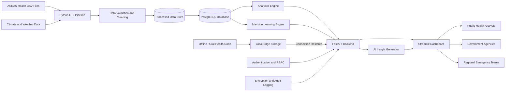

# Project RISING System Architecture

## Overview

Project RISING is an AI-powered digital health intelligence platform designed
to help ASEAN governments and public-health organizations analyze health
indicators, detect inequalities, forecast future risks, and maintain healthcare
operations during climate-related disruptions.

The MVP combines:

- Data engineering
- Artificial intelligence
- Machine learning
- FastAPI
- Dashboard visualization
- Secure access controls
- Climate-resilient edge architecture

## High-Level Architecture

## Architecture Layers

### 1. Data Source Layer

The data-source layer includes:

- ASEAN historical health datasets
- Climate datasets
- Weather datasets
- Population datasets
- Future hospital and laboratory data

### 2. Data Engineering Layer

The ETL pipeline:

- Extracts data from CSV files
- Standardizes country names
- Converts years and values into valid formats
- Removes duplicate records
- Handles missing values
- Validates data quality
- Produces analysis-ready datasets

### 3. Storage Layer

The MVP initially stores processed data as CSV or Parquet files.

PostgreSQL will later provide:

- Structured storage
- Fast analytical queries
- API access
- Country and indicator filtering
- Historical trend storage

### 4. Analytics Layer

The analytics engine calculates:

- Country comparisons
- Regional averages
- Health inequality gaps
- Mortality trends
- Life-expectancy trends
- Vulnerability scores

### 5. Machine-Learning Layer

The machine-learning engine will:

- Forecast health indicators
- Detect abnormal trends
- Estimate future mortality rates
- Calculate health-risk levels

### 6. API Layer

FastAPI exposes processed health data and predictions through secure endpoints.

Example endpoints:

- `GET /`
- `GET /health`
- `GET /countries`
- `GET /indicators`
- `GET /trends`
- `GET /predictions`

### 7. AI Insight Layer

The AI insight layer converts analytical findings into readable public-health
recommendations.

Example:

> Infant mortality is declining in Country A, but the rate remains above the
> ASEAN regional average. Continued investment in maternal and neonatal care
> is recommended.

### 8. Dashboard Layer

The dashboard displays:

- Regional health indicators
- Country comparisons
- Historical trends
- Forecasts
- Risk scores
- AI-generated insights

### 9. Security Layer

The security layer includes:

- Authentication
- Role-based access control
- Password hashing
- Data encryption
- Input validation
- Audit logs
- Environment-variable protection

### 10. Climate-Resilient Edge Layer

Rural healthcare facilities can continue working during:

- Internet failures
- Floods
- Storms
- Power outages
- Infrastructure disruptions

Data is stored locally and synchronized after connectivity returns.

## Technology Stack

| Layer | Technology |
|---|---|
| Programming | Python |
| Data processing | Pandas and NumPy |
| Machine learning | Scikit-learn |
| Backend API | FastAPI |
| API server | Uvicorn |
| Database | PostgreSQL |
| Dashboard | Streamlit |
| Visualization | Plotly |
| Testing | Pytest |
| Version control | Git and GitHub |
| Deployment | Docker and cloud hosting |

