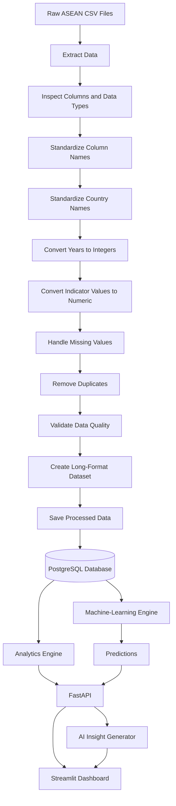

# Project RISING Data Flow Architecture

## Purpose

This document explains how data moves through Project RISING from raw ASEAN
datasets to dashboards, machine-learning predictions, and AI-generated
recommendations.

## Data Flow Diagram

## Input Data

The system processes historical health indicators such as:

- Crude birth rate
- Crude death rate
- Life expectancy
- Infant mortality
- Under-five mortality
- Maternal mortality
- Undernourishment
- Healthcare expenditure

## Standard Data Format

All datasets will be transformed into the following structure:

| Field | Description |
|---|---|
| country | ASEAN country name |
| country_code | Standard country code |
| year | Observation year |
| indicator | Health indicator name |
| value | Numeric indicator value |
| unit | Measurement unit |
| source | Dataset source |
| processed_at | Processing timestamp |

## Data Quality Rules

The pipeline checks for:

- Missing country names
- Invalid years
- Non-numeric values
- Duplicate observations
- Unsupported ASEAN countries
- Missing indicator names
- Values outside realistic ranges

## Output

The final output supports:

- Country comparison
- Regional trend analysis
- Machine-learning forecasting
- API queries
- Dashboard visualization
- AI-generated recommendations