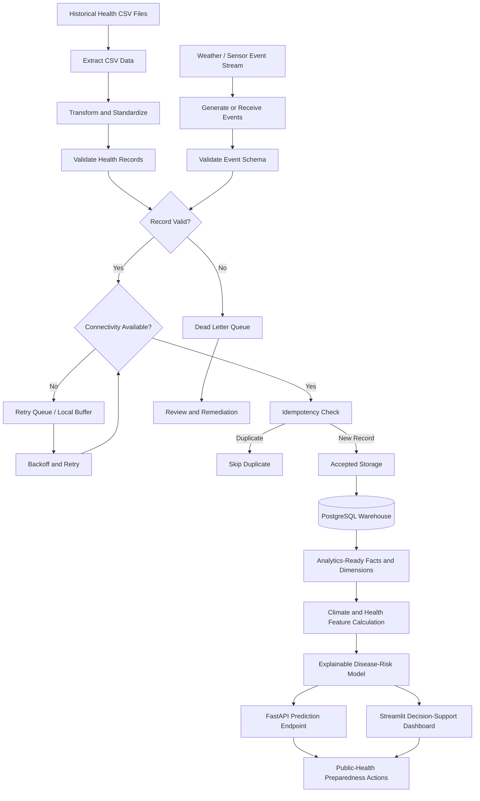

# Project RISING Data Flow Architecture

## Purpose

This document explains how Project RISING moves data from raw inputs to trusted outputs while protecting records during connectivity failures.

The data flow is designed to answer one question:

```text
What happens to health and climate data when the network is unreliable?
```

## Hybrid Pipeline Flow



## Batch Data Flow

Batch data starts from historical CSV files under:

```text
data/raw/
```

The pipeline:

1. Reads raw CSV files.
2. Handles encoding differences.
3. Standardizes column names.
4. Standardizes country names.
5. Converts years and values into valid formats.
6. Handles sex-specific and sub-indicator fields.
7. Validates required fields.
8. Writes processed outputs.

Batch outputs:

```text
data/processed/asean_health_indicators.csv
data/processed/indicator_metadata.csv
```

## Streaming Data Flow

Streaming data starts from simulated weather events.

The demo writes generated input events to:

```text
data/streaming/weather_events.jsonl
```

Each event passes through:

1. Schema validation.
2. Duplicate detection.
3. Simulated network failure handling.
4. Retry logic.
5. Accepted-event writing.
6. DLQ routing for invalid or exhausted records.

Streaming outputs:

```text
data/streaming/accepted_weather_events.jsonl
data/streaming/weather_events_dlq.jsonl
data/streaming/checkpoints.txt
```

## Warehouse Loading Flow

Accepted streaming events can be loaded into PostgreSQL:

```powershell
docker compose up -d postgres
py demo\run_streaming_demo.py --load-postgres
```

The loader writes to:

- `dim_country`
- `dim_source`
- `dim_station`
- `dim_date`
- `dim_quality_status`
- `fact_weather_observation`

The fact table uses `event_id` as a unique key, so duplicate event loads are ignored.

## Data Quality Rules

The system checks for:

- Missing countries.
- Unsupported ASEAN countries.
- Invalid years.
- Non-numeric values.
- Missing indicators.
- Invalid weather event fields.
- Duplicate event fingerprints.
- Malformed records.

## Failure Handling

| Failure Type | Handling |
|---|---|
| Invalid schema | Route to DLQ |
| Temporary outage | Retry with backoff |
| Retry exhausted | Route to DLQ |
| Duplicate event | Skip using checkpoint or warehouse constraint |
| Warehouse unavailable | Keep accepted JSONL output available for later sync |

## Trusted Data Boundary

Only validated and accepted records should enter the trusted analytics layer.

```text
Raw input is not trusted.
DLQ data is not trusted.
Accepted storage and warehouse tables are trusted.
```

This separation is the governance foundation of Project RISING.

## Decision-Support Flow

The working prediction path combines two trusted input groups:

1. The latest available country values for malaria prevalence and infant
   mortality from the processed ASEAN health dataset.
2. A current or scenario-based temperature, rainfall, and humidity observation.

The model converts these values into normalized climate suitability and
historical health vulnerability components. The final score uses documented
70% climate and 30% health weights and returns the evidence, recommendations,
model version, and limitations with every response.

```text
POST /api/v1/disease-risk/predict
            |
            v
Validate country + weather inputs
            |
            v
Read latest processed health evidence
            |
            v
Calculate climate suitability + health vulnerability
            |
            v
Return 14-day risk score, level, explanation, and actions
```

This prediction is a transparent hackathon preparedness signal. It is not a
clinically validated outbreak forecast.
