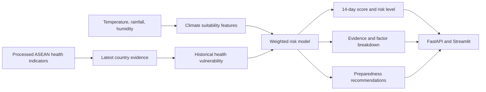

# Project RISING Decision-Support Architecture

## Current Capability

Project RISING includes a working, explainable climate-health risk model behind
`POST /api/v1/disease-risk/predict`. The model is downstream of validated data:

```text
Reliable data first. Explainable decision support second.
```



## Method

The version 1.0 model is a deterministic statistical scoring model. It does not
claim to be trained on outbreak labels.

- Temperature suitability peaks near 28°C and falls as conditions move away.
- Rainfall pressure rises to its cap at 200 mm.
- Humidity pressure rises above 50% and reaches its cap at 90%.
- Historical vulnerability normalizes the latest available malaria prevalence
  and infant mortality values against countries in the repository dataset.
- The final score weights climate suitability at 70% and historical health
  vulnerability at 30%.

Thresholds are low below 35, moderate from 35 to below 65, and high at 65 or
above. Every response includes its inputs, component scores, source indicator
years and values, model version, recommendations, and responsible-use warning.

## Why This Approach Fits the MVP

The repository does not contain verified outbreak labels aligned to climate
observations. Training a classifier on invented labels would produce a more
impressive-sounding but less honest result. The transparent model provides a
real, testable decision-support output while making its evidence and limits easy
for judges and public-health users to inspect.

## Production Evolution

With authoritative, time-aligned surveillance labels, the same service boundary
can support a validated forecasting model:

1. Ingest live meteorological and disease-surveillance feeds.
2. Build time-lagged features with documented provenance.
3. Train and cross-validate by geography and season.
4. Calibrate probabilities and measure false-negative rates.
5. Monitor drift, missingness, and subgroup performance.
6. Retain the current explanation and human-review contract.

## Responsible Use

- Use aggregated public-health data rather than patient identifiers.
- Never present the score as a diagnosis or confirmed outbreak.
- Keep source dates, assumptions, and model version visible.
- Require local surveillance confirmation before operational escalation.
- Keep human public-health decision-makers in control.
