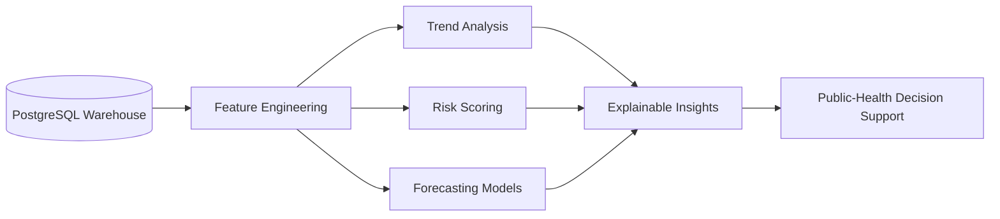

# Project RISING AI Architecture

## Role of AI

AI is a downstream layer in Project RISING, not the foundation of the MVP.

The foundation is the resilient data pipeline. AI should only run on data that has already passed validation, retry handling, deduplication, and warehouse loading.

In other words:

```text
Reliable data first.
AI insights second.
```

## Why AI Is Downstream

During climate disruption, the first problem is not prediction. The first problem is data continuity.

If records are lost, delayed, duplicated, or malformed, AI outputs become unreliable. Project RISING therefore prioritizes:

- Data validation.
- Retry and recovery.
- DLQ isolation.
- Idempotent processing.
- Warehouse synchronization.

Once those are stable, AI can help decision-makers interpret the trusted data.

## Future AI Flow



## Possible Future AI Capabilities

### 1. Health Trend Forecasting

Forecast future values for indicators such as:

- Life expectancy.
- Infant mortality.
- Under-five mortality.
- Maternal mortality.
- Government health expenditure.

### 2. Climate-Health Risk Scoring

Combine climate and health indicators to estimate risk.

Example:

```text
Heavy rainfall
+ high humidity
+ weak health-system capacity
+ historical disease burden
= higher climate-health vulnerability
```

### 3. Anomaly Detection

Detect unusual changes in health indicators or weather-linked event patterns.

Example:

```text
A country records a sudden increase in mortality or weather-risk events compared with its historical trend.
```

### 4. Explainable Decision Support

Convert analytics into readable summaries for public-health teams.

Example:

```text
The current vulnerability score is elevated because rainfall is high, under-five mortality remains above the regional average, and health expenditure is below peer countries.
```

## MVP Position

For the hackathon MVP, AI should be presented as future decision support.

The current project demonstrates the more important prerequisite:

```text
Can we keep trusted data flowing when climate disruption breaks normal connectivity?
```

That resilient data foundation makes future AI credible.

## Responsible AI Principles

Future AI work should follow these principles:

- Use aggregated public-health data.
- Avoid patient-level identification.
- Explain model outputs.
- Document limitations.
- Avoid unsupported medical conclusions.
- Keep human decision-makers in control.

## Summary

AI remains part of the Project RISING roadmap, but the MVP story is data engineering resilience.

Judges should understand that Project RISING does not claim useful AI without first proving trustworthy data movement.
