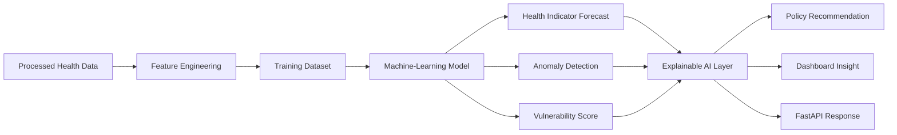

# Project RISING AI Architecture

## Objective

The AI layer helps public-health decision-makers understand historical trends,
forecast future outcomes, detect unusual patterns, and identify countries that
may require additional healthcare investment.

## AI Architecture Diagram



## AI Functions

### 1. Forecasting

The system forecasts future values for indicators such as:

- Life expectancy
- Infant mortality
- Under-five mortality
- Maternal mortality

Initial models:

- Linear regression
- Random forest regression
- Gradient boosting regression

### 2. Anomaly Detection

The system identifies unusual changes.

Example:

> Maternal mortality increased sharply compared with the country's historical
> trend.

### 3. Health Vulnerability Scoring

The system combines multiple indicators into a vulnerability score.

Possible inputs:

- Infant mortality
- Maternal mortality
- Under-five mortality
- Life expectancy
- Undernourishment
- Healthcare expenditure

Example scoring logic:

```text
High mortality
+ Low life expectancy
+ High undernourishment
+ Low healthcare investment
= Higher vulnerability score
```

### 4. Explainable AI

Every model output should include an understandable explanation.

Example:

> The predicted increase in health vulnerability is mainly associated with
> persistent under-five mortality and low healthcare expenditure.

## MVP AI Scope

The hackathon MVP will begin with:

1. One forecasting model
2. One health vulnerability score
3. Rule-based explainable insights
4. Model evaluation metrics

## Model Evaluation

Possible evaluation metrics:

- Mean Absolute Error
- Mean Squared Error
- Root Mean Squared Error
- R-squared score

## Responsible AI Principles

Project RISING follows these principles:

- Use aggregated public-health data
- Avoid patient-level identification
- Explain model outputs
- Document limitations
- Prevent unsupported medical conclusions
- Keep human decision-makers in control