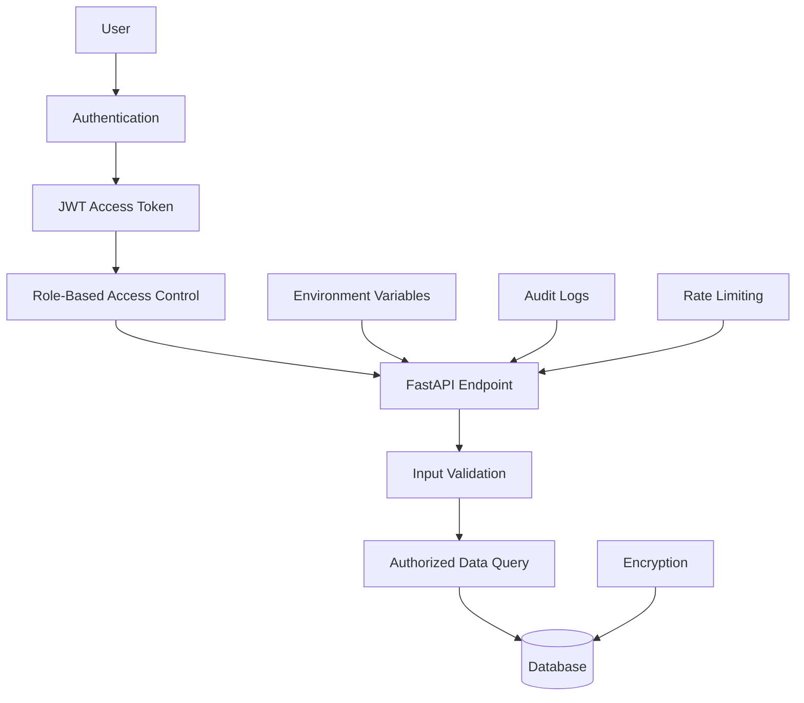

# Project RISING Security Architecture

## Objective

Project RISING uses a security-by-design approach to protect public-health data,
API services, model outputs, and system access.

## Security Architecture Diagram



## Security Controls

### Authentication

Users must prove their identity before accessing protected endpoints.

### Role-Based Access Control

Proposed roles:

| Role | Access |
|---|---|
| Regional administrator | ASEAN-wide aggregated information |
| National health official | Authorized national information |
| Health analyst | Analytics and predictions |
| Clinic worker | Local data submission |
| Public user | Public aggregated statistics |

### Password Security

Passwords must be:

- Hashed
- Salted
- Never stored as plain text

### API Security

The API will use:

- JWT tokens
- Request validation
- Error handling
- Rate limiting
- Restricted endpoints

### Encryption

Data should be encrypted:

- In transit using HTTPS
- At rest in the database
- During edge synchronization

### Secrets Management

Sensitive information should be stored in:

```text
.env
```

The `.env` file must not be pushed to GitHub.

### Audit Logging

The system should record:

- Login attempts
- Data modifications
- API access
- Administrative actions
- Failed authorization attempts

## Data Privacy

The MVP uses aggregated country-level data and does not process personally
identifiable patient information.

Future versions should align with applicable ASEAN national privacy laws and
regional data-sharing agreements.