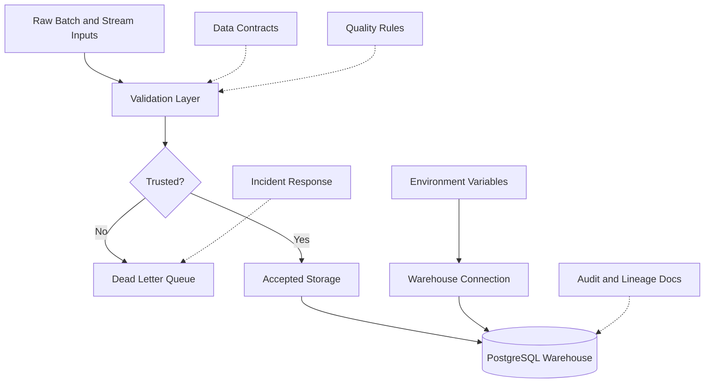

# Project RISING Security Architecture

## Objective

Project RISING uses security-by-design principles to protect public-health data, pipeline credentials, warehouse access, and operational logs.

The MVP uses aggregated country-level public-health data and simulated weather events. It does not process patient-level personally identifiable information.

Even so, the system is designed with future sensitive-health integration in mind.

## Security Architecture



## MVP Security Controls

### 1. Data Minimization

The MVP uses aggregated health indicators and simulated weather events.

No patient names, addresses, IDs, phone numbers, or clinical records are required for the hackathon demo.

### 2. Input Validation

Records are validated before they become trusted data.

Invalid records are routed to DLQ instead of entering processed outputs or warehouse facts.

### 3. Dead Letter Queue Isolation

Malformed or permanently failed records are isolated in:

```text
data/streaming/weather_events_dlq.jsonl
```

This protects the trusted analytics layer from corrupted records.

### 4. Idempotency and Duplicate Protection

The streaming pipeline uses checkpoints to avoid repeated processing.

The PostgreSQL weather fact table also enforces uniqueness on `event_id`.

### 5. Secrets and Configuration

Warehouse credentials should be managed through environment variables in production.

The demo uses local Docker credentials for reproducibility:

```text
rising_user / rising_password
```

Production deployments should use:

```text
DATABASE_URL
.env
secret manager
```

The `.env` file must not be committed.

### 6. Warehouse Access Control

Future warehouse access should separate:

- Read-only analytics users.
- Pipeline service accounts.
- Administrative users.
- Incident-response reviewers.

### 7. Auditability

The project includes governance documentation for:

- Data contracts.
- Data quality rules.
- Data lineage.
- Retention policy.
- Incident response.
- Uptime and SLOs.

These documents make the system easier to operate and review.

## Future Security Enhancements

For production, Project RISING should add:

- HTTPS for APIs.
- Encrypted data at rest.
- Encrypted edge synchronization.
- Role-based access control.
- Audit logs for pipeline loads.
- Secret rotation.
- Backup and restore policies.
- Network restrictions for database access.

## Privacy Position

The MVP is safe for public demonstration because it uses aggregated datasets and simulated events.

Future patient-level integrations would require stronger privacy controls, national regulatory review, consent and lawful-basis analysis, and stricter operational governance.
