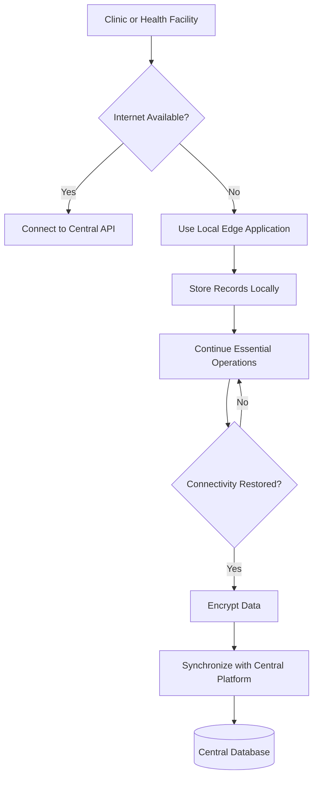

# Project RISING Climate-Resilience Architecture

## Objective

Project RISING is designed to maintain essential healthcare-data operations
during climate-related disasters and infrastructure failures.

## Climate-Resilient Workflow



## Climate Risks Addressed

The design supports disruptions caused by:

- Flooding
- Tropical storms
- Heatwaves
- Power failures
- Internet outages
- Damaged transport infrastructure
- Emergency evacuation

## Edge Node Capabilities

A future edge node may include:

- Low-power computer
- Local database
- Offline dashboard
- Solar power
- Battery backup
- Automatic synchronization
- Encrypted local storage

## MVP Simulation

The MVP will simulate the edge workflow by:

1. Saving records locally while offline
2. Marking records as unsynchronized
3. Detecting restored connectivity
4. Uploading pending records
5. Recording synchronization status

## Climate-Informed Decision Support

Future climate data can include:

- Rainfall
- Temperature
- Flood alerts
- Humidity
- Mosquito suitability
- Drought
- Food-security indicators

This information can be combined with health indicators to estimate disease
and healthcare-service risks.

## Example

```text
Heavy rainfall
+ High humidity
+ Rising dengue cases
+ Limited clinic capacity
= High public-health alert
```

## Resilience Benefits

- Healthcare continuity
- Faster emergency response
- Reduced data loss
- Support for rural clinics
- Improved disaster preparedness
- Better resource allocation