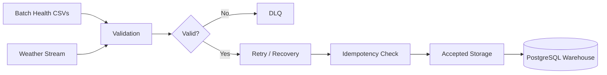

# Project RISING Architecture Index

Project RISING is documented as a climate-resilient health data engineering platform.

The architecture is organized around the MVP goal:

```text
Keep trusted public-health data flowing during climate-induced connectivity failures.
```

## Documents

- [System Architecture](01_system_architecture.md): end-to-end system design and major components.
- [Data Flow Architecture](02_data_flow.md): batch and streaming movement from raw inputs to DLQ or warehouse.
- [AI Architecture](03_ai_architecture.md): future AI decision-support layer built on trusted warehouse data.
- [Security Architecture](04_security_architecture.md): validation, isolation, secrets, access control, and privacy posture.
- [Climate-Resilience Architecture](05_climate_resilience.md): offline-first and disruption-tolerant design principles.

## Core Pipeline


